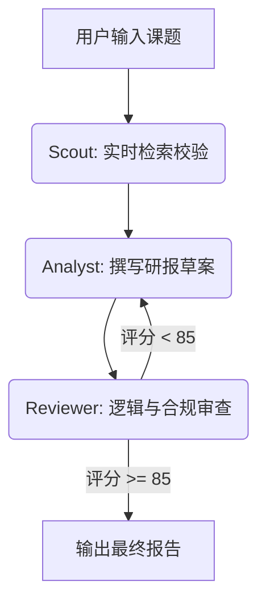

# general-business-and-financial-analysis

> **基于LangGraph构建的具备动态时间锚点与多Agent协同机制的实时金融深度分析引擎。**

## 🌟 核心突破：解决LLM的“时间迷失”

大多数大模型受限于训练数据的截断期，在处理时效性课题（如“节前后走势”）时，极易产生年份幻觉。本项目通过以下机制实现精准分析：

- **动态时间锚点注入**：系统实时感知当前物理时间，并将其作为硬性约束注入Agent决策流。
- **搜索词自动纠偏**：在检索阶段引入严格的年份校验逻辑，强制过滤过时信息，确保数据源100%实时。
- **自我进化闭环**：基于LangGraph的条件边逻辑，若报告评分未达标（<85分），系统将自动触发迭代重写。

## 🛠️ 技术架构

本项目采用了三位一体的智能体集群架构：

| 角色                       | 核心职能        | 技术手段                |
|:-------------------------|:------------|:--------------------|
| **Scout Agent (侦察员)**    | 任务拆解与实时检索校验 | 动态时间注入 + DuckDuckGo |
| **Analyst Agent (分析师)**  | 多维数据合成与报告撰写 | 基本面/消息面/政策面深度对齐     |
| **Reviewer Agent (审查官)** | 逻辑风控与量化打分   | 提示词工程 + 正则分数提取      |

## 📐 工作流图示



## 🚀 快速上手

### 1. 环境准备

确保你的环境中已安装Python 3.10+，并安装依赖：

```bash
pip install langgraph langchain-openai langchain-community duckduckgo-search
```

克隆本项目：

```bash
git clone [https://github.com/qdTuT/general-business-and-financial-analysis.git](https://github.com/qdTuT/general-business-and-financial-analysis.git)
```

### 2. 配置文件

在项目根目录（或父目录）创建`.env`文件，填入你的API Key：

```env
OPENAI_API_KEY=your_key_here
OPENAI_BASE_URL=[https://api.aihubmix.com/v1](https://api.aihubmix.com/v1)
OPENAI_MODEL_ID=coding-glm-5.1
```

### 3. 运行程序

```bash
python finguard.py
```